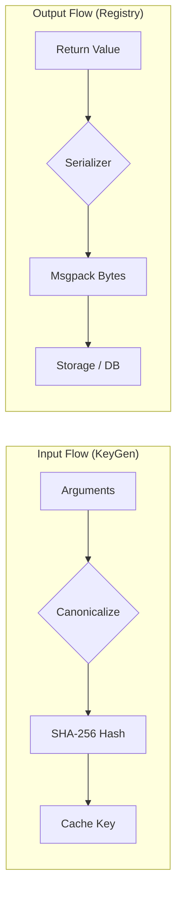

# Data Serialization & Registry

`beautyspot` におけるデータの変換処理には、明確に異なる2つの役割があります。ここを混同しないことが、正しくライブラリを使いこなすコツです。

1.  **Cache Key Generation (Input):** 関数の「引数」をハッシュ化し、キャッシュの **ID (Key)** を決める。
2.  **Result Serialization (Output):** 関数の「戻り値」をバイナリ化し、DBやストレージに **保存 (Persist)** する。

このページでは、後者の「戻り値の保存」について解説します。

## Input vs Output の違い

| 機能 | 対象 | 役割 | 設定方法 |
| :--- | :--- | :--- | :--- |
| **KeyGen** | **引数 (Inputs)** | 「前回と同じ入力か？」を判定する | `input_key_fn=...` <br> (ローカル設定) |
| **Registry** | **戻り値 (Outputs)** | データをディスクに保存・復元する | `spot.register(...)` <br> (グローバル設定) |



## 標準のシリアライズ (Msgpack)

`beautyspot` はデフォルトで **Msgpack** を使用しています。以下の型は設定なしで保存・復元が可能です。

* Python プリミティブ (`int`, `float`, `str`, `bool`, `bytes`, `None`)
* コレクション (`dict`, `list`, `tuple`)

## カスタム型の登録 (`spot.register`)

独自のクラスや、標準でサポートされていない型（例: Pandas DataFrame, PyTorch Tensorなど）を関数の **戻り値** として返したい場合、`register` デコレータを使ってシリアライズ方法を教える必要があります。

### 基本的な使い方

クラス定義にデコレータを添えるだけです。

```python
import msgpack

@spot.register(
    code=10,  # 0-127 の間でユニークなIDを指定
    encoder=lambda obj: obj.to_bytes(),        # Object -> bytes
    decoder=lambda data: MyClass.from_bytes(data) # bytes -> Object
)
class MyClass:
    def __init__(self, x, y):
        self.x = x
        self.y = y

    def to_bytes(self):
        return msgpack.packb([self.x, self.y])

    @staticmethod
    def from_bytes(data):
        x, y = msgpack.unpackb(data)
        return MyClass(x, y)

```

### 既存のライブラリ型を登録する

自分で定義していないクラス（例: `numpy.ndarray`）を登録する場合は、`spot.register_type` 関数を使用します。

```python
import numpy as np
import io

def encode_numpy(arr):
    # メモリ上のバイナリとして書き出し
    with io.BytesIO() as f:
        np.save(f, arr)
        return f.getvalue()

def decode_numpy(data):
    with io.BytesIO(data) as f:
        return np.load(f)

# アプリケーション起動時に登録
spot.register_type(
    type_=np.ndarray,
    code=20,
    encoder=encode_numpy,
    decoder=decode_numpy
)

```

## よくある間違い

!!! warning "引数にカスタム型を渡す場合"
関数の **引数** としてカスタム型を渡すだけであれば、`register` は **不要** です。
`KeyGen` はオブジェクトの内部構造（`__dict__`など）を自動的に検査してハッシュを作るからです。

`register` が必要なのは、あくまでそのオブジェクトを **「キャッシュとして保存（永続化）」** したい場合のみです。

