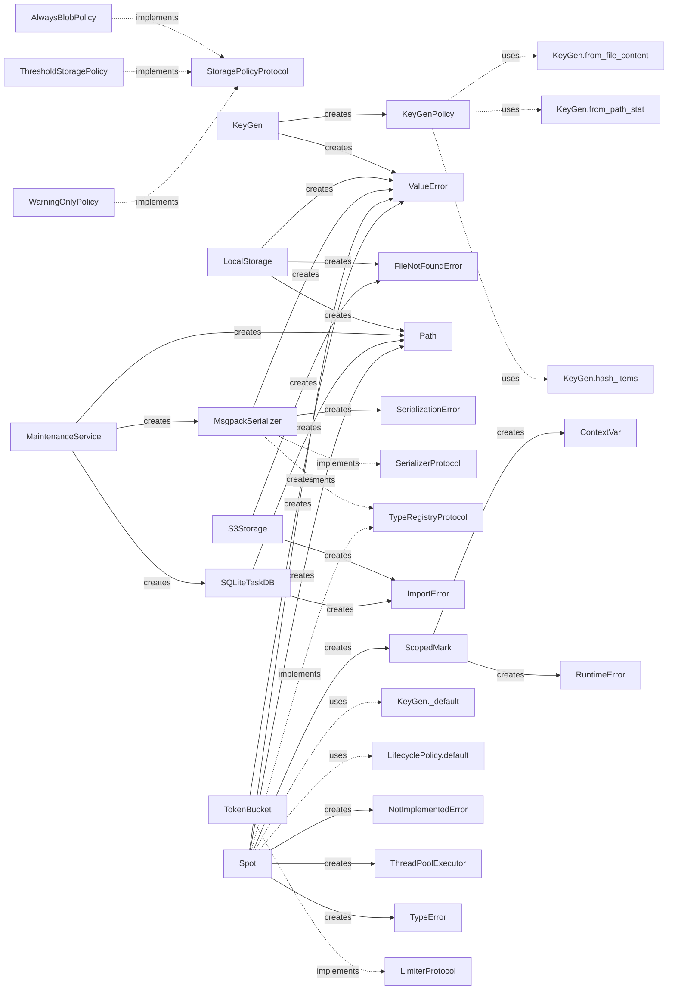

# 📊 Beautyspot Quality Report
**最終更新:** 2026-02-18 15:16:24

## 1. アーキテクチャ可視化
### 1.1 依存関係図 (Pydeps)


### 1.2 安定度分析 (Instability Analysis)
青: 安定(Core系) / 赤: 不安定(高依存系)。矢印は依存の方向を示します。


<details>
<summary>🔍 安定度メトリクスの詳細（Ca/Ce/I）を表示</summary>

```text
Module          | Ca  | Ce  | I (Instability)
---------------------------------------------
_version        | 0   | 0   | 0.00
content_types   | 1   | 0   | 0.00
dashboard       | 0   | 2   | 1.00
cachekey        | 1   | 0   | 0.00
limiter         | 1   | 0   | 0.00
serializer      | 2   | 0   | 0.00
storage         | 2   | 0   | 0.00
lifecycle       | 1   | 0   | 0.00
core            | 0   | 6   | 1.00
db              | 2   | 0   | 0.00
maintenance     | 2   | 3   | 0.60
cli             | 0   | 1   | 1.00

Graph generated at: docs/statics/img/generated/architecture_metrics.png
```
</details>

## 2. コード品質メトリクス
### 2.1 循環的複雑度 (Cyclomatic Complexity)
#### ⚠️ 警告 (Rank C 以上)
複雑すぎてリファクタリングが推奨される箇所です。

```text
src/beautyspot/cli.py
    F 302:0 show_cmd - C
    F 645:0 prune_cmd - C
    F 380:0 stats_cmd - C

3 blocks (classes, functions, methods) analyzed.
Average complexity: C (11.666666666666666)
```

<details>
<summary>📄 すべての CC メトリクス一覧を表示</summary>

```text
src/beautyspot/content_types.py
    C 3:0 ContentType - A
src/beautyspot/dashboard.py
    F 53:0 load_data - A
    F 14:0 get_args - A
    F 34:0 render_mermaid - A
src/beautyspot/cachekey.py
    F 120:0 _canonicalize_type - B
    F 58:0 canonicalize - B
    F 36:0 _canonicalize_instance - A
    M 258:4 KeyGen.from_file_content - A
    F 48:0 _is_ndarray_like - A
    C 237:0 KeyGen - A
    M 276:4 KeyGen._default - A
    F 16:0 _safe_sort_key - A
    F 85:0 _canonicalize_dict - A
    F 95:0 _canonicalize_sequence - A
    F 102:0 _canonicalize_set - A
    C 187:0 KeyGenPolicy - A
    M 249:4 KeyGen.from_path_stat - A
    M 299:4 KeyGen.hash_items - A
    M 309:4 KeyGen.ignore - A
    M 324:4 KeyGen.file_content - A
    M 332:4 KeyGen.path_stat - A
    F 31:0 _canonicalize_ndarray - A
    F 109:0 _canonicalize_enum - A
    F 163:4 _canonicalize_np_ndarray - A
    C 174:0 Strategy - A
    M 193:4 KeyGenPolicy.__init__ - A
    M 201:4 KeyGenPolicy.bind - A
    M 317:4 KeyGen.map - A
src/beautyspot/limiter.py
    M 46:4 TokenBucket._consume_reservation - A
    C 18:0 TokenBucket - A
    C 10:0 LimiterProtocol - A
    M 30:4 TokenBucket.__init__ - A
    M 76:4 TokenBucket.consume - A
    M 94:4 TokenBucket.consume_async - A
    M 11:4 LimiterProtocol.consume - A
    M 14:4 LimiterProtocol.consume_async - A
src/beautyspot/serializer.py
    M 84:4 MsgpackSerializer._default_packer - B
    C 40:0 MsgpackSerializer - A
    M 161:4 MsgpackSerializer.dumps - A
    M 138:4 MsgpackSerializer._ext_hook - A
    M 182:4 MsgpackSerializer.loads - A
    C 9:0 SerializerProtocol - A
    C 21:0 TypeRegistryProtocol - A
    M 54:4 MsgpackSerializer.register - A
    M 14:4 SerializerProtocol.dumps - A
    M 17:4 SerializerProtocol.loads - A
    M 25:4 TypeRegistryProtocol.register - A
    C 35:0 SerializationError - A
    M 48:4 MsgpackSerializer.__init__ - A
src/beautyspot/storage.py
    M 193:4 LocalStorage.prune_empty_dirs - B
    C 116:0 LocalStorage - A
    M 122:4 LocalStorage._validate_key - A
    M 178:4 LocalStorage.list_keys - A
    M 233:4 S3Storage.__init__ - A
    C 44:0 WarningOnlyPolicy - A
    M 145:4 LocalStorage.load - A
    M 163:4 LocalStorage.delete - A
    C 232:0 S3Storage - A
    M 269:4 S3Storage.list_keys - A
    F 277:0 create_storage - A
    C 24:0 StoragePolicyProtocol - A
    C 33:0 ThresholdStoragePolicy - A
    M 52:4 WarningOnlyPolicy.should_save_as_blob - A
    C 61:0 AlwaysBlobPolicy - A
    C 78:0 BlobStorageBase - A
    M 254:4 S3Storage.load - A
    M 262:4 S3Storage.delete - A
    M 29:4 StoragePolicyProtocol.should_save_as_blob - A
    M 40:4 ThresholdStoragePolicy.should_save_as_blob - A
    M 66:4 AlwaysBlobPolicy.should_save_as_blob - A
    C 72:0 CacheCorruptedError - A
    M 84:4 BlobStorageBase.save - A
    M 92:4 BlobStorageBase.load - A
    M 99:4 BlobStorageBase.delete - A
    M 107:4 BlobStorageBase.list_keys - A
    M 117:4 LocalStorage.__init__ - A
    M 129:4 LocalStorage.save - A
    M 248:4 S3Storage.save - A
src/beautyspot/__init__.py
    F 30:0 Spot - B
src/beautyspot/lifecycle.py
    F 13:0 parse_retention - B
    C 62:0 LifecyclePolicy - A
    M 69:4 LifecyclePolicy.resolve - A
    C 50:0 Rule - A
    C 44:0 Retention - A
    M 57:4 Rule.__init__ - A
    M 66:4 LifecyclePolicy.__init__ - A
    M 81:4 LifecyclePolicy.default - A
src/beautyspot/core.py
    M 457:4 Spot._check_cache_sync - B
    M 216:4 Spot._resolve_key_fn - A
    M 507:4 Spot._save_result_sync - A
    M 282:4 Spot._resolve_settings - A
    M 686:4 Spot.cached_run - A
    C 49:0 ScopedMark - A
    M 70:4 ScopedMark.__enter__ - A
    C 119:0 Spot - A
    M 124:4 Spot.__init__ - A
    M 184:4 Spot._setup_workspace - A
    M 198:4 Spot.shutdown - A
    M 243:4 Spot.register - A
    M 301:4 Spot._make_cache_key - A
    M 323:4 Spot._calculate_expires_at - A
    M 339:4 Spot._execute_sync - A
    M 396:4 Spot._execute_async - A
    M 594:4 Spot.mark - A
    M 112:4 ScopedMark.__exit__ - A
    M 205:4 Spot.__exit__ - A
    M 266:4 Spot.register_type - A
    M 493:4 Spot._save_result_safe - A
    M 56:4 ScopedMark.__init__ - A
    M 179:4 Spot._track_future - A
    M 195:4 Spot._shutdown_executor - A
    M 202:4 Spot.__enter__ - A
    M 557:4 Spot.limiter - A
    M 578:4 Spot.mark - A
    M 581:4 Spot.mark - A
    M 659:4 Spot.cached_run - A
    M 674:4 Spot.cached_run - A
src/beautyspot/db.py
    M 95:4 SQLiteTaskDB.init_schema - B
    M 127:4 SQLiteTaskDB.get - A
    M 228:4 SQLiteTaskDB.get_outdated_tasks - A
    M 258:4 SQLiteTaskDB.get_blob_refs - A
    C 83:0 SQLiteTaskDB - A
    M 189:4 SQLiteTaskDB.get_history - A
    C 24:0 TaskDBBase - A
    M 213:4 SQLiteTaskDB.prune - A
    M 246:4 SQLiteTaskDB.delete_expired - A
    C 18:0 TaskRecord - A
    M 30:4 TaskDBBase.init_schema - A
    M 34:4 TaskDBBase.get - A
    M 38:4 TaskDBBase.save - A
    M 53:4 TaskDBBase.get_history - A
    M 57:4 TaskDBBase.delete - A
    M 61:4 TaskDBBase.delete_expired - A
    M 65:4 TaskDBBase.prune - A
    M 72:4 TaskDBBase.get_outdated_tasks - A
    M 78:4 TaskDBBase.get_blob_refs - A
    M 88:4 SQLiteTaskDB.__init__ - A
    M 92:4 SQLiteTaskDB._connect - A
    M 157:4 SQLiteTaskDB.save - A
    M 208:4 SQLiteTaskDB.delete - A
src/beautyspot/maintenance.py
    M 175:4 MaintenanceService.clean_garbage - B
    M 74:4 MaintenanceService.get_task_detail - B
    M 153:4 MaintenanceService.scan_garbage - B
    M 113:4 MaintenanceService.delete_task - A
    M 205:4 MaintenanceService.scan_orphan_projects - A
    C 17:0 MaintenanceService - A
    M 28:4 MaintenanceService.from_path - A
    M 225:4 MaintenanceService.delete_project_storage - A
    M 22:4 MaintenanceService.__init__ - A
    M 70:4 MaintenanceService.get_history - A
    M 108:4 MaintenanceService.delete_expired_tasks - A
    M 135:4 MaintenanceService.get_prunable_tasks - A
    M 139:4 MaintenanceService.prune - A
    M 146:4 MaintenanceService.clear - A
src/beautyspot/cli.py
    F 302:0 show_cmd - C
    F 645:0 prune_cmd - C
    F 380:0 stats_cmd - C
    F 561:0 gc_cmd - B
    F 161:0 _list_tasks - B
    F 214:0 ui_cmd - B
    F 477:0 clean_cmd - B
    F 101:0 _list_databases - A
    F 446:0 clear_cmd - A
    F 48:0 _find_available_port - A
    F 58:0 _format_size - A
    F 32:0 get_service - A
    F 71:0 _get_task_count - A
    F 284:0 list_cmd - A
    F 743:0 version_cmd - A
    F 43:0 _is_port_in_use - A
    F 66:0 _format_timestamp - A
    F 762:0 main - A

172 blocks (classes, functions, methods) analyzed.
Average complexity: A (2.7674418604651163)
```
</details>

### 2.2 保守性指数 (Maintainability Index)
#### ⚠️ 警告 (Rank B 以下)
コードの読みやすさ・保守しやすさに改善の余地があるモジュールです。

```text
なし（すべて Rank A です ✨）
```

<details>
<summary>📄 すべての MI メトリクス一覧を表示</summary>

```text
src/beautyspot/_version.py - A
src/beautyspot/content_types.py - A
src/beautyspot/dashboard.py - A
src/beautyspot/cachekey.py - A
src/beautyspot/limiter.py - A
src/beautyspot/serializer.py - A
src/beautyspot/storage.py - A
src/beautyspot/__init__.py - A
src/beautyspot/lifecycle.py - A
src/beautyspot/core.py - A
src/beautyspot/db.py - A
src/beautyspot/maintenance.py - A
src/beautyspot/cli.py - A
```
</details>

## 4. デザイン・インテント分析 (Design Intent Map)
クラス図には現れない、生成関係、静的利用、および Protocol への暗黙的な準拠を可視化します。


