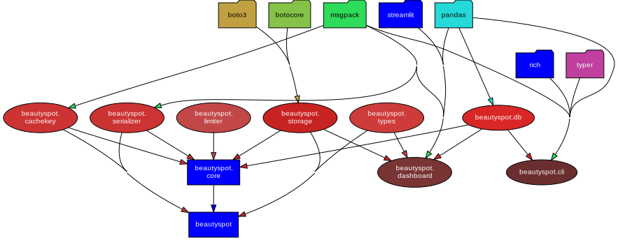

# 📊 Beautyspot Quality Report
**最終更新:** 2026-02-16 19:42:37

## 1. アーキテクチャ可視化
### 1.1 依存関係図 (Pydeps)


### 1.2 安定度分析 (Instability Analysis)
青: 安定(Core系) / 赤: 不安定(高依存系)。矢印は依存の方向を示します。


<details>
<summary>🔍 安定度メトリクスの詳細（Ca/Ce/I）を表示</summary>

```text
Module          | Ca  | Ce  | I (Instability)
---------------------------------------------
_version        | 0   | 0   | 0.00
dashboard       | 0   | 3   | 1.00
limiter         | 1   | 0   | 0.00
cachekey        | 1   | 0   | 0.00
cli             | 0   | 1   | 1.00
core            | 0   | 5   | 1.00
db              | 3   | 0   | 0.00
serializer      | 1   | 0   | 0.00
storage         | 2   | 0   | 0.00
types           | 1   | 0   | 0.00

Graph generated at: docs/statics/img/generated/architecture_metrics.png
```
</details>

## 2. コード品質メトリクス
### 2.1 循環的複雑度 (Cyclomatic Complexity)
#### ⚠️ 警告 (Rank C 以上)
複雑すぎてリファクタリングが推奨される箇所です。

```text
src/beautyspot/cachekey.py
    F 25:0 canonicalize - D
src/beautyspot/cli.py
    F 528:0 clean_cmd - D
    F 695:0 prune_cmd - C

3 blocks (classes, functions, methods) analyzed.
Average complexity: D (21.333333333333332)
```

<details>
<summary>📄 すべての CC メトリクス一覧を表示</summary>

```text
src/beautyspot/dashboard.py
    F 62:0 load_data - A
    F 17:0 get_args - A
    F 34:0 render_mermaid - A
src/beautyspot/limiter.py
    M 36:4 TokenBucket._consume_reservation - A
    C 8:0 TokenBucket - A
    M 20:4 TokenBucket.__init__ - A
    M 66:4 TokenBucket.consume - A
    M 84:4 TokenBucket.consume_async - A
src/beautyspot/cachekey.py
    F 25:0 canonicalize - D
    M 206:4 KeyGen.from_file_content - A
    C 180:0 KeyGen - A
    M 224:4 KeyGen._default - A
    F 14:0 _safe_sort_key - A
    C 124:0 KeyGenPolicy - A
    M 197:4 KeyGen.from_path_stat - A
    M 247:4 KeyGen.hash_items - A
    M 257:4 KeyGen.ignore - A
    M 283:4 KeyGen.file_content - A
    M 295:4 KeyGen.path_stat - A
    C 111:0 Strategy - A
    M 133:4 KeyGenPolicy.__init__ - A
    M 141:4 KeyGenPolicy.bind - A
    M 269:4 KeyGen.map - A
src/beautyspot/cli.py
    F 528:0 clean_cmd - D
    F 695:0 prune_cmd - C
    F 410:0 stats_cmd - B
    F 347:0 show_cmd - B
    F 848:0 _clean_orphaned_blobs - B
    F 296:0 _list_tasks - B
    F 113:0 ui_cmd - B
    F 478:0 clear_cmd - B
    F 230:0 _list_databases - A
    F 49:0 _find_available_port - A
    F 60:0 _format_size - A
    F 87:0 _infer_blob_dir - A
    F 34:0 get_db - A
    F 75:0 _get_task_count - A
    F 203:0 list_cmd - A
    F 886:0 version_cmd - A
    F 43:0 _is_port_in_use - A
    F 69:0 _format_timestamp - A
    F 905:0 main - A
src/beautyspot/core.py
    M 472:4 Spot._check_cache_sync - B
    M 615:4 Spot.mark - B
    M 247:4 Spot._resolve_key_fn - A
    M 508:4 Spot._save_result_sync - A
    M 885:4 Spot.delete - A
    M 352:4 Spot._resolve_settings - A
    M 778:4 Spot.cached_run - A
    C 47:0 ScopedMark - A
    M 59:4 ScopedMark.__enter__ - A
    C 120:0 Spot - A
    M 195:4 Spot._setup_workspace - A
    M 217:4 Spot.shutdown - A
    M 280:4 Spot.register - A
    M 366:4 Spot._make_cache_key - A
    M 125:4 Spot.__init__ - A
    M 323:4 Spot.register_type - A
    M 388:4 Spot._execute_sync - A
    M 425:4 Spot._execute_async - A
    M 851:4 Spot.run - A
    M 53:4 ScopedMark.__init__ - A
    M 101:4 ScopedMark.__exit__ - A
    C 106:0 SpotOptions - A
    M 207:4 Spot._shutdown_executor - A
    M 227:4 Spot.__enter__ - A
    M 236:4 Spot.__exit__ - A
    M 564:4 Spot.limiter - A
    M 595:4 Spot.mark - A
    M 601:4 Spot.mark - A
    M 752:4 Spot.cached_run - A
    M 767:4 Spot.cached_run - A
src/beautyspot/db.py
    M 108:4 SQLiteTaskDB.init_schema - A
    C 97:0 SQLiteTaskDB - A
    M 184:4 SQLiteTaskDB.get_history - A
    C 23:0 TaskDB - A
    M 138:4 SQLiteTaskDB.get - A
    C 17:0 TaskRecord - A
    M 30:4 TaskDB.init_schema - A
    M 35:4 TaskDB.get - A
    M 40:4 TaskDB.save - A
    M 67:4 TaskDB.get_history - A
    M 89:4 TaskDB.delete - A
    M 102:4 SQLiteTaskDB.__init__ - A
    M 105:4 SQLiteTaskDB._connect - A
    M 153:4 SQLiteTaskDB.save - A
    M 224:4 SQLiteTaskDB.delete - A
src/beautyspot/serializer.py
    M 69:4 MsgpackSerializer._default_packer - B
    C 25:0 MsgpackSerializer - A
    M 146:4 MsgpackSerializer.dumps - A
    M 123:4 MsgpackSerializer._ext_hook - A
    M 167:4 MsgpackSerializer.loads - A
    C 7:0 SerializerProtocol - A
    M 39:4 MsgpackSerializer.register - A
    M 12:4 SerializerProtocol.dumps - A
    M 15:4 SerializerProtocol.loads - A
    C 19:0 SerializationError - A
    M 33:4 MsgpackSerializer.__init__ - A
src/beautyspot/storage.py
    M 82:4 LocalStorage._validate_key - A
    M 142:4 S3Storage.__init__ - A
    C 77:0 LocalStorage - A
    M 101:4 LocalStorage.load - A
    M 127:4 LocalStorage.delete - A
    C 141:0 S3Storage - A
    F 181:0 create_storage - A
    C 26:0 BlobStorageBase - A
    M 162:4 S3Storage.load - A
    M 172:4 S3Storage.delete - A
    C 20:0 CacheCorruptedError - A
    M 35:4 BlobStorageBase.save - A
    M 50:4 BlobStorageBase.load - A
    M 66:4 BlobStorageBase.delete - A
    M 78:4 LocalStorage.__init__ - A
    M 89:4 LocalStorage.save - A
    M 156:4 S3Storage.save - A
src/beautyspot/types.py
    C 3:0 ContentType - A
src/beautyspot/__init__.py
    C 22:0 Spot - A
    M 26:4 Spot.__init__ - A

118 blocks (classes, functions, methods) analyzed.
Average complexity: A (3.093220338983051)
```
</details>

### 2.2 保守性指数 (Maintainability Index)
#### ⚠️ 警告 (Rank B 以下)
コードの読みやすさ・保守しやすさに改善の余地があるモジュールです。

```text
なし（すべて Rank A です ✨）
```

<details>
<summary>📄 すべての MI メトリクス一覧を表示</summary>

```text
src/beautyspot/_version.py - A
src/beautyspot/dashboard.py - A
src/beautyspot/limiter.py - A
src/beautyspot/cachekey.py - A
src/beautyspot/cli.py - A
src/beautyspot/core.py - A
src/beautyspot/db.py - A
src/beautyspot/serializer.py - A
src/beautyspot/storage.py - A
src/beautyspot/types.py - A
src/beautyspot/__init__.py - A
```
</details>
