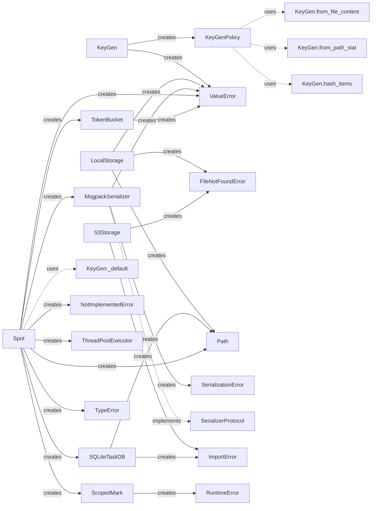

# 📊 Beautyspot Quality Report
**最終更新:** 2026-02-16 21:42:20

## 1. アーキテクチャ可視化
### 1.1 依存関係図 (Pydeps)


### 1.2 安定度分析 (Instability Analysis)
青: 安定(Core系) / 赤: 不安定(高依存系)。矢印は依存の方向を示します。


<details>
<summary>🔍 安定度メトリクスの詳細（Ca/Ce/I）を表示</summary>

```text
Module          | Ca  | Ce  | I (Instability)
---------------------------------------------
_version        | 0   | 0   | 0.00
dashboard       | 0   | 3   | 1.00
limiter         | 1   | 0   | 0.00
serializer      | 1   | 0   | 0.00
types           | 1   | 0   | 0.00
cachekey        | 1   | 0   | 0.00
storage         | 3   | 0   | 0.00
db              | 3   | 0   | 0.00
core            | 1   | 5   | 0.83
maintenance     | 1   | 2   | 0.67
cli             | 0   | 2   | 1.00

Graph generated at: docs/statics/img/generated/architecture_metrics.png
```
</details>

## 2. コード品質メトリクス
### 2.1 循環的複雑度 (Cyclomatic Complexity)
#### ⚠️ 警告 (Rank C 以上)
複雑すぎてリファクタリングが推奨される箇所です。

```text
src/beautyspot/cachekey.py
    F 27:0 canonicalize - C
src/beautyspot/cli.py
    F 536:0 prune_cmd - C
    F 363:0 stats_cmd - C

3 blocks (classes, functions, methods) analyzed.
Average complexity: C (11.333333333333334)
```

<details>
<summary>📄 すべての CC メトリクス一覧を表示</summary>

```text
src/beautyspot/dashboard.py
    F 62:0 load_data - A
    F 17:0 get_args - A
    F 34:0 render_mermaid - A
src/beautyspot/limiter.py
    M 36:4 TokenBucket._consume_reservation - A
    C 8:0 TokenBucket - A
    M 20:4 TokenBucket.__init__ - A
    M 66:4 TokenBucket.consume - A
    M 84:4 TokenBucket.consume_async - A
src/beautyspot/serializer.py
    M 69:4 MsgpackSerializer._default_packer - B
    C 25:0 MsgpackSerializer - A
    M 146:4 MsgpackSerializer.dumps - A
    M 123:4 MsgpackSerializer._ext_hook - A
    M 167:4 MsgpackSerializer.loads - A
    C 7:0 SerializerProtocol - A
    M 39:4 MsgpackSerializer.register - A
    M 12:4 SerializerProtocol.dumps - A
    M 15:4 SerializerProtocol.loads - A
    C 19:0 SerializationError - A
    M 33:4 MsgpackSerializer.__init__ - A
src/beautyspot/types.py
    C 3:0 ContentType - A
src/beautyspot/cachekey.py
    F 27:0 canonicalize - C
    F 92:0 _ - B
    M 210:4 KeyGen.from_file_content - A
    C 189:0 KeyGen - A
    M 228:4 KeyGen._default - A
    F 15:0 _safe_sort_key - A
    F 68:0 _ - A
    F 78:0 _ - A
    F 85:0 _ - A
    C 139:0 KeyGenPolicy - A
    M 201:4 KeyGen.from_path_stat - A
    M 251:4 KeyGen.hash_items - A
    M 261:4 KeyGen.ignore - A
    M 276:4 KeyGen.file_content - A
    M 284:4 KeyGen.path_stat - A
    C 126:0 Strategy - A
    M 145:4 KeyGenPolicy.__init__ - A
    M 153:4 KeyGenPolicy.bind - A
    M 269:4 KeyGen.map - A
src/beautyspot/storage.py
    M 69:4 LocalStorage._validate_key - A
    M 120:4 S3Storage.__init__ - A
    C 64:0 LocalStorage - A
    M 88:4 LocalStorage.load - A
    M 110:4 LocalStorage.list_keys - A
    C 119:0 S3Storage - A
    M 156:4 S3Storage.list_keys - A
    F 164:0 create_storage - A
    C 26:0 BlobStorageBase - A
    M 104:4 LocalStorage.delete - A
    M 141:4 S3Storage.load - A
    M 149:4 S3Storage.delete - A
    C 20:0 CacheCorruptedError - A
    M 32:4 BlobStorageBase.save - A
    M 40:4 BlobStorageBase.load - A
    M 47:4 BlobStorageBase.delete - A
    M 55:4 BlobStorageBase.list_keys - A
    M 65:4 LocalStorage.__init__ - A
    M 76:4 LocalStorage.save - A
    M 135:4 S3Storage.save - A
src/beautyspot/db.py
    M 91:4 SQLiteTaskDB.init_schema - A
    M 201:4 SQLiteTaskDB.get_outdated_tasks - A
    M 219:4 SQLiteTaskDB.get_blob_refs - A
    C 80:0 SQLiteTaskDB - A
    M 162:4 SQLiteTaskDB.get_history - A
    C 24:0 TaskDB - A
    M 118:4 SQLiteTaskDB.get - A
    M 186:4 SQLiteTaskDB.prune - A
    C 18:0 TaskRecord - A
    M 30:4 TaskDB.init_schema - A
    M 34:4 TaskDB.get - A
    M 38:4 TaskDB.save - A
    M 52:4 TaskDB.get_history - A
    M 56:4 TaskDB.delete - A
    M 61:4 TaskDB.prune - A
    M 68:4 TaskDB.get_outdated_tasks - A
    M 75:4 TaskDB.get_blob_refs - A
    M 85:4 SQLiteTaskDB.__init__ - A
    M 88:4 SQLiteTaskDB._connect - A
    M 132:4 SQLiteTaskDB.save - A
    M 181:4 SQLiteTaskDB.delete - A
src/beautyspot/core.py
    M 412:4 Spot._check_cache_sync - B
    M 529:4 Spot.mark - B
    M 240:4 Spot._resolve_key_fn - A
    M 447:4 Spot._save_result_sync - A
    M 689:4 Spot.delete - A
    M 307:4 Spot._resolve_settings - A
    M 632:4 Spot.cached_run - A
    C 47:0 ScopedMark - A
    M 59:4 ScopedMark.__enter__ - A
    C 119:0 Spot - A
    M 177:4 Spot.from_path - A
    M 216:4 Spot._setup_workspace - A
    M 230:4 Spot.shutdown - A
    M 267:4 Spot.register - A
    M 317:4 Spot._make_cache_key - A
    M 124:4 Spot.__init__ - A
    M 290:4 Spot.register_type - A
    M 338:4 Spot._execute_sync - A
    M 369:4 Spot._execute_async - A
    M 662:4 Spot.run - A
    M 53:4 ScopedMark.__init__ - A
    M 101:4 ScopedMark.__exit__ - A
    C 106:0 SpotOptions - A
    M 227:4 Spot._shutdown_executor - A
    M 234:4 Spot.__enter__ - A
    M 237:4 Spot.__exit__ - A
    M 494:4 Spot.limiter - A
    M 515:4 Spot.mark - A
    M 518:4 Spot.mark - A
    M 607:4 Spot.cached_run - A
    M 621:4 Spot.cached_run - A
src/beautyspot/maintenance.py
    M 72:4 MaintenanceService.clean_garbage - A
    M 53:4 MaintenanceService.scan_garbage - A
    C 14:0 MaintenanceService - A
    M 20:4 MaintenanceService.__init__ - A
    M 24:4 MaintenanceService.get_prunable_tasks - A
    M 31:4 MaintenanceService.prune - A
    M 41:4 MaintenanceService.clear - A
src/beautyspot/cli.py
    F 536:0 prune_cmd - C
    F 363:0 stats_cmd - C
    F 307:0 show_cmd - B
    F 166:0 _list_tasks - B
    F 219:0 ui_cmd - B
    F 461:0 clean_cmd - B
    F 106:0 _list_databases - A
    F 429:0 clear_cmd - A
    F 53:0 _find_available_port - A
    F 63:0 _format_size - A
    F 34:0 get_spot - A
    F 76:0 _get_task_count - A
    F 289:0 list_cmd - A
    F 633:0 version_cmd - A
    F 48:0 _is_port_in_use - A
    F 71:0 _format_timestamp - A
    F 652:0 main - A
src/beautyspot/__init__.py
    F 24:0 Spot - A

136 blocks (classes, functions, methods) analyzed.
Average complexity: A (2.6911764705882355)
```
</details>

### 2.2 保守性指数 (Maintainability Index)
#### ⚠️ 警告 (Rank B 以下)
コードの読みやすさ・保守しやすさに改善の余地があるモジュールです。

```text
なし（すべて Rank A です ✨）
```

<details>
<summary>📄 すべての MI メトリクス一覧を表示</summary>

```text
src/beautyspot/_version.py - A
src/beautyspot/dashboard.py - A
src/beautyspot/limiter.py - A
src/beautyspot/serializer.py - A
src/beautyspot/types.py - A
src/beautyspot/cachekey.py - A
src/beautyspot/storage.py - A
src/beautyspot/db.py - A
src/beautyspot/core.py - A
src/beautyspot/maintenance.py - A
src/beautyspot/cli.py - A
src/beautyspot/__init__.py - A
```
</details>

## 4. デザイン・インテント分析 (Design Intent Map)
クラス図には現れない、生成関係、静的利用、および Protocol への暗黙的な準拠を可視化します。


