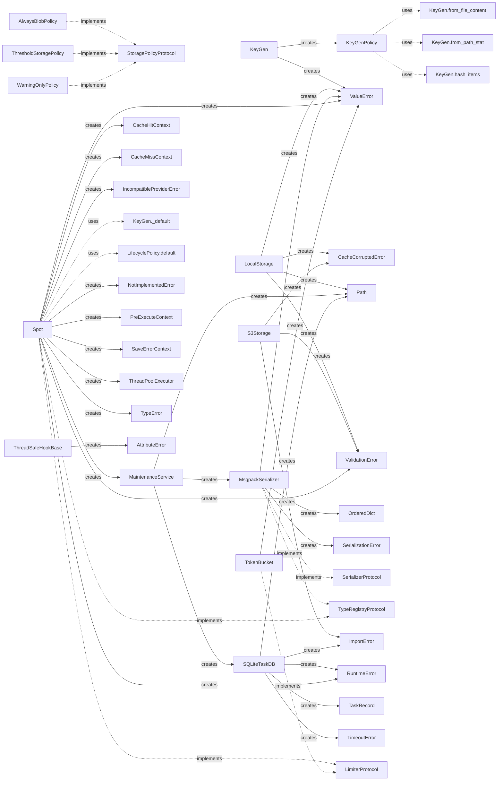

# 📊 Beautyspot Quality Report
**最終更新:** 2026-02-25 02:41:43

## 1. アーキテクチャ可視化
### 1.1 依存関係図 (Pydeps)


### 1.2 安定度分析 (Instability Analysis)
青: 安定(Core系) / 赤: 不安定(高依存系)。矢印は依存の方向を示します。


<details>
<summary>🔍 安定度メトリクスの詳細（Ca/Ce/I）を表示</summary>

```text
Module          | Ca  | Ce  | I (Instability)
---------------------------------------------
limiter         | 1   | 0   | 0.00
exceptions      | 4   | 0   | 0.00
_version        | 0   | 0   | 0.00
types           | 2   | 0   | 0.00
content_types   | 2   | 0   | 0.00
maintenance     | 3   | 3   | 0.50
hooks           | 1   | 1   | 0.50
cli             | 0   | 2   | 1.00
dashboard       | 0   | 2   | 1.00
cachekey        | 1   | 0   | 0.00
lifecycle       | 1   | 1   | 0.50
serializer      | 2   | 1   | 0.33
storage         | 2   | 1   | 0.33
db              | 3   | 0   | 0.00
core            | 0   | 11  | 1.00

Graph generated at: docs/statics/img/generated/architecture_metrics.png
```
</details>

## 2. コード品質メトリクス
### 2.1 循環的複雑度 (Cyclomatic Complexity)
#### ⚠️ 警告 (Rank C 以上)
複雑すぎてリファクタリングが推奨される箇所です。

```text
src/beautyspot/maintenance.py
    M 238:4 MaintenanceService.clean_garbage - C
    M 188:4 MaintenanceService.scan_garbage - C
src/beautyspot/cli.py
    F 581:0 gc_cmd - D
    F 326:0 _show_cmd_inner - C
    F 149:0 _list_tasks_inner - C
    F 419:0 _stats_cmd_inner - C
    F 766:0 _prune_cmd_inner - C
src/beautyspot/cachekey.py
    F 199:0 _canonicalize_type - C
src/beautyspot/lifecycle.py
    F 43:0 parse_retention - C
src/beautyspot/db.py
    M 523:4 SQLiteTaskDB.flush - C
src/beautyspot/core.py
    M 712:4 Spot._execute_sync - C
    M 864:4 Spot._execute_async - C

12 blocks (classes, functions, methods) analyzed.
Average complexity: C (13.25)
```

<details>
<summary>📄 すべての CC メトリクス一覧を表示</summary>

```text
src/beautyspot/limiter.py
    M 44:4 TokenBucket._consume_reservation - A
    C 16:0 TokenBucket - A
    C 10:0 LimiterProtocol - A
    M 28:4 TokenBucket.__init__ - A
    M 74:4 TokenBucket.consume - A
    M 92:4 TokenBucket.consume_async - A
    M 11:4 LimiterProtocol.consume - A
    M 13:4 LimiterProtocol.consume_async - A
src/beautyspot/exceptions.py
    C 4:0 BeautySpotError - A
    C 12:0 CacheCorruptedError - A
    C 19:0 SerializationError - A
    C 25:0 ConfigurationError - A
    C 32:0 ValidationError - A
    C 39:0 IncompatibleProviderError - A
src/beautyspot/types.py
    C 9:0 SaveErrorContext - A
    C 43:0 HookContextBase - A
    C 54:0 PreExecuteContext - A
    C 61:0 CacheHitContext - A
    C 69:0 CacheMissContext - A
src/beautyspot/content_types.py
    C 6:0 ContentType - A
src/beautyspot/__init__.py
    F 44:0 Spot - B
src/beautyspot/maintenance.py
    M 238:4 MaintenanceService.clean_garbage - C
    M 188:4 MaintenanceService.scan_garbage - C
    M 103:4 MaintenanceService.get_task_detail - B
    M 49:4 MaintenanceService.from_path - A
    M 147:4 MaintenanceService.delete_task - A
    M 345:4 MaintenanceService.scan_orphan_projects - A
    C 19:0 MaintenanceService - A
    M 317:4 MaintenanceService.resolve_key_prefix - A
    M 365:4 MaintenanceService.delete_project_storage - A
    M 33:4 MaintenanceService.close - A
    M 24:4 MaintenanceService.__init__ - A
    M 42:4 MaintenanceService.__enter__ - A
    M 45:4 MaintenanceService.__exit__ - A
    M 99:4 MaintenanceService.get_history - A
    M 142:4 MaintenanceService.delete_expired_tasks - A
    M 169:4 MaintenanceService.get_prunable_tasks - A
    M 175:4 MaintenanceService.prune - A
    M 182:4 MaintenanceService.clear - A
src/beautyspot/hooks.py
    C 44:0 ThreadSafeHookBase - A
    M 68:4 ThreadSafeHookBase.__init_subclass__ - A
    C 12:0 HookBase - A
    M 77:4 ThreadSafeHookBase.__getattr__ - A
    F 33:0 _wrap_with_lock - A
    M 23:4 HookBase.pre_execute - A
    M 26:4 HookBase.on_cache_hit - A
    M 29:4 HookBase.on_cache_miss - A
    M 74:4 ThreadSafeHookBase.__init__ - A
src/beautyspot/cli.py
    F 581:0 gc_cmd - D
    F 326:0 _show_cmd_inner - C
    F 149:0 _list_tasks_inner - C
    F 419:0 _stats_cmd_inner - C
    F 766:0 _prune_cmd_inner - C
    F 227:0 ui_cmd - B
    F 527:0 _clean_cmd_inner - B
    F 84:0 _list_databases - A
    F 474:0 clear_cmd - A
    F 50:0 _find_available_port - A
    F 60:0 _format_size - A
    F 33:0 get_service - A
    F 297:0 list_cmd - A
    F 731:0 prune_cmd - A
    F 842:0 version_cmd - A
    F 45:0 _is_port_in_use - A
    F 68:0 _format_timestamp - A
    F 75:0 _get_task_count - A
    F 144:0 _list_tasks - A
    F 315:0 show_cmd - A
    F 409:0 stats_cmd - A
    F 501:0 clean_cmd - A
    F 861:0 main - A
src/beautyspot/dashboard.py
    F 58:0 load_data - A
    F 15:0 get_args - A
    F 39:0 render_mermaid - A
src/beautyspot/cachekey.py
    F 199:0 _canonicalize_type - C
    F 42:0 _canonicalize_instance - B
    F 96:0 canonicalize - B
    M 345:4 KeyGen.from_file_content - A
    M 363:4 KeyGen._default - A
    F 85:0 _is_ndarray_like - A
    C 324:0 KeyGen - A
    M 395:4 KeyGen.hash_items - A
    F 21:0 _safe_sort_key - A
    F 123:0 _canonicalize_dict - A
    F 132:0 _canonicalize_list - A
    F 143:0 _canonicalize_tuple - A
    F 154:0 _canonicalize_set - A
    F 161:0 _canonicalize_deque - A
    F 173:0 _canonicalize_ordereddict - A
    C 267:0 KeyGenPolicy - A
    M 336:4 KeyGen.from_path_stat - A
    M 412:4 KeyGen.ignore - A
    M 427:4 KeyGen.file_content - A
    M 435:4 KeyGen.path_stat - A
    F 37:0 _canonicalize_ndarray - A
    F 167:0 _canonicalize_defaultdict - A
    F 188:0 _canonicalize_enum - A
    F 242:4 _canonicalize_np_ndarray - A
    C 254:0 Strategy - A
    M 273:4 KeyGenPolicy.__init__ - A
    M 281:4 KeyGenPolicy.bind - A
    M 420:4 KeyGen.map - A
src/beautyspot/lifecycle.py
    F 43:0 parse_retention - C
    M 139:4 LifecyclePolicy.resolve_with_fallback - A
    C 120:0 LifecyclePolicy - A
    M 128:4 LifecyclePolicy.resolve - A
    C 14:0 _ForeverSentinel - A
    M 24:4 _ForeverSentinel.__new__ - A
    M 29:4 _ForeverSentinel.__repr__ - A
    M 32:4 _ForeverSentinel.__bool__ - A
    C 94:0 Retention - A
    C 111:0 Rule - A
    M 125:4 LifecyclePolicy.__init__ - A
    M 157:4 LifecyclePolicy.default - A
src/beautyspot/serializer.py
    M 102:4 MsgpackSerializer._default_packer - B
    C 38:0 MsgpackSerializer - A
    M 67:4 MsgpackSerializer.register - A
    M 171:4 MsgpackSerializer.dumps - A
    M 154:4 MsgpackSerializer._ext_hook - A
    M 182:4 MsgpackSerializer.loads - A
    C 22:0 SerializerProtocol - A
    C 28:0 TypeRegistryProtocol - A
    M 92:4 MsgpackSerializer._enforce_cache_size - A
    M 23:4 SerializerProtocol.dumps - A
    M 24:4 SerializerProtocol.loads - A
    M 29:4 TypeRegistryProtocol.register - A
    M 56:4 MsgpackSerializer.__init__ - A
src/beautyspot/storage.py
    M 304:4 LocalStorage.prune_empty_dirs - B
    M 280:4 LocalStorage.clean_temp_files - B
    C 151:0 LocalStorage - A
    M 368:4 S3Storage._parse_s3_uri - A
    M 171:4 LocalStorage._validate_key - A
    M 212:4 LocalStorage.load - A
    M 233:4 LocalStorage.delete - A
    M 257:4 LocalStorage.list_keys - A
    M 352:4 S3Storage.__init__ - A
    C 51:0 WarningOnlyPolicy - A
    M 158:4 LocalStorage._ensure_cache_dir - A
    M 186:4 LocalStorage.save - A
    M 271:4 LocalStorage.get_mtime - A
    C 351:0 S3Storage - A
    M 418:4 S3Storage.list_keys - A
    F 425:0 create_storage - A
    C 28:0 StoragePolicyProtocol - A
    C 38:0 ThresholdStoragePolicy - A
    M 66:4 WarningOnlyPolicy.should_save_as_blob - A
    C 76:0 AlwaysBlobPolicy - A
    C 89:0 BlobStorageBase - A
    M 388:4 S3Storage.load - A
    M 396:4 S3Storage.delete - A
    M 409:4 S3Storage.get_mtime - A
    M 34:4 StoragePolicyProtocol.should_save_as_blob - A
    M 46:4 ThresholdStoragePolicy.should_save_as_blob - A
    M 82:4 AlwaysBlobPolicy.should_save_as_blob - A
    M 95:4 BlobStorageBase.save - A
    M 103:4 BlobStorageBase.load - A
    M 110:4 BlobStorageBase.delete - A
    M 118:4 BlobStorageBase.list_keys - A
    M 127:4 BlobStorageBase.get_mtime - A
    M 134:4 BlobStorageBase.prune_empty_dirs - A
    M 142:4 BlobStorageBase.clean_temp_files - A
    M 152:4 LocalStorage.__init__ - A
    M 380:4 S3Storage.save - A
src/beautyspot/db.py
    M 523:4 SQLiteTaskDB.flush - C
    M 213:4 SQLiteTaskDB._enqueue_write - B
    M 182:4 SQLiteTaskDB._writer_loop - B
    M 306:4 SQLiteTaskDB.get - B
    M 242:4 SQLiteTaskDB.shutdown - A
    C 133:0 SQLiteTaskDB - A
    M 442:4 SQLiteTaskDB.get_outdated_tasks - A
    M 479:4 SQLiteTaskDB.get_blob_refs - A
    F 24:0 _ensure_utc_isoformat - A
    M 156:4 SQLiteTaskDB._ensure_cache_dir - A
    M 385:4 SQLiteTaskDB.get_history - A
    M 490:4 SQLiteTaskDB.get_keys_start_with - A
    M 506:4 SQLiteTaskDB.count_tasks - A
    C 53:0 TaskDBBase - A
    M 138:4 SQLiteTaskDB.__init__ - A
    M 463:4 SQLiteTaskDB.delete_expired - A
    C 35:0 TaskRecord - A
    C 43:0 _WriteTask - A
    M 59:4 TaskDBBase.init_schema - A
    M 63:4 TaskDBBase.get - A
    M 69:4 TaskDBBase.save - A
    M 85:4 TaskDBBase.get_history - A
    M 89:4 TaskDBBase.delete - A
    M 93:4 TaskDBBase.delete_expired - A
    M 97:4 TaskDBBase.prune - A
    M 104:4 TaskDBBase.get_outdated_tasks - A
    M 112:4 TaskDBBase.get_blob_refs - A
    M 116:4 TaskDBBase.delete_all - A
    M 120:4 TaskDBBase.get_keys_start_with - A
    M 124:4 TaskDBBase.flush - A
    M 128:4 TaskDBBase.shutdown - A
    M 169:4 SQLiteTaskDB._read_connect - A
    M 260:4 SQLiteTaskDB.init_schema - A
    M 342:4 SQLiteTaskDB.save - A
    M 404:4 SQLiteTaskDB.delete - A
    M 411:4 SQLiteTaskDB.delete_all - A
    M 424:4 SQLiteTaskDB.prune - A
src/beautyspot/core.py
    M 712:4 Spot._execute_sync - C
    M 864:4 Spot._execute_async - C
    M 1026:4 Spot._check_cache_sync - B
    M 342:4 Spot._ensure_bg_resources - B
    M 416:4 Spot.flush - B
    M 474:4 Spot._trigger_auto_eviction - B
    M 112:4 _BackgroundLoop.submit - B
    M 390:4 Spot.shutdown - B
    M 1168:4 Spot._save_result_sync - B
    M 1377:4 Spot.cached_run - B
    M 143:4 _BackgroundLoop.stop - A
    M 232:4 Spot.__init__ - A
    M 559:4 Spot._resolve_key_fn - A
    M 627:4 Spot._calculate_expires_at - A
    C 70:0 _BackgroundLoop - A
    C 180:0 Spot - A
    M 326:4 Spot.maintenance - A
    M 656:4 Spot._dispatch_hooks - A
    M 101:4 _BackgroundLoop._task_wrapper - A
    M 468:4 Spot._get_func_identifier - A
    M 586:4 Spot.register - A
    M 691:4 Spot._make_cache_key - A
    M 1074:4 Spot._submit_background_save - A
    M 1105:4 Spot._invoke_error_callback - A
    M 1278:4 Spot.mark - A
    M 312:4 Spot._track_future - A
    M 378:4 Spot._shutdown_resources - A
    M 611:4 Spot.register_type - A
    M 674:4 Spot._resolve_settings - A
    M 1155:4 Spot._save_result_safe - A
    M 76:4 _BackgroundLoop.__init__ - A
    M 93:4 _BackgroundLoop._run_event_loop - A
    M 172:4 _BackgroundLoop._shutdown - A
    M 301:4 Spot.__enter__ - A
    M 304:4 Spot.__exit__ - A
    M 464:4 Spot._drain_futures - A
    M 1092:4 Spot._build_save_error_context - A
    M 1117:4 Spot._notify_save_discarded - A
    M 1133:4 Spot._handle_save_error - A
    M 1141:4 Spot._save_result_async - A
    M 1232:4 Spot.consume - A
    M 1261:4 Spot.mark - A
    M 1264:4 Spot.mark - A
    M 1345:4 Spot.cached_run - A
    M 1362:4 Spot.cached_run - A

245 blocks (classes, functions, methods) analyzed.
Average complexity: A (3.053061224489796)
```
</details>

### 2.2 保守性指数 (Maintainability Index)
#### ⚠️ 警告 (Rank B 以下)
コードの読みやすさ・保守しやすさに改善の余地があるモジュールです。

```text
src/beautyspot/core.py - B
```

<details>
<summary>📄 すべての MI メトリクス一覧を表示</summary>

```text
src/beautyspot/limiter.py - A
src/beautyspot/exceptions.py - A
src/beautyspot/_version.py - A
src/beautyspot/types.py - A
src/beautyspot/content_types.py - A
src/beautyspot/__init__.py - A
src/beautyspot/maintenance.py - A
src/beautyspot/hooks.py - A
src/beautyspot/cli.py - A
src/beautyspot/dashboard.py - A
src/beautyspot/cachekey.py - A
src/beautyspot/lifecycle.py - A
src/beautyspot/serializer.py - A
src/beautyspot/storage.py - A
src/beautyspot/db.py - A
src/beautyspot/core.py - B
```
</details>

## 4. デザイン・インテント分析 (Design Intent Map)
クラス図には現れない、生成関係、静的利用、および Protocol への暗黙的な準拠を可視化します。


