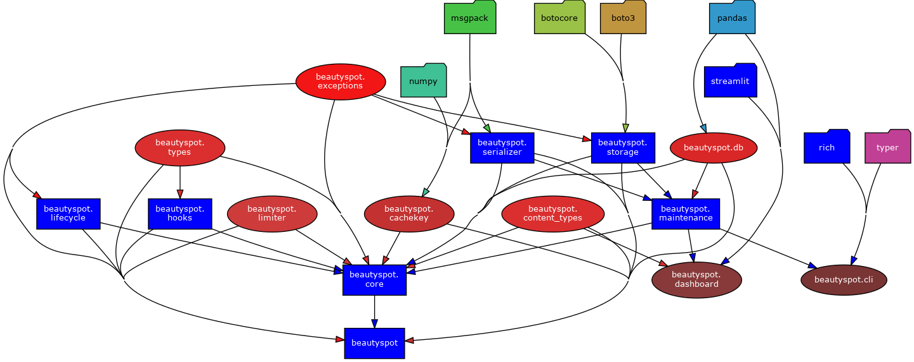
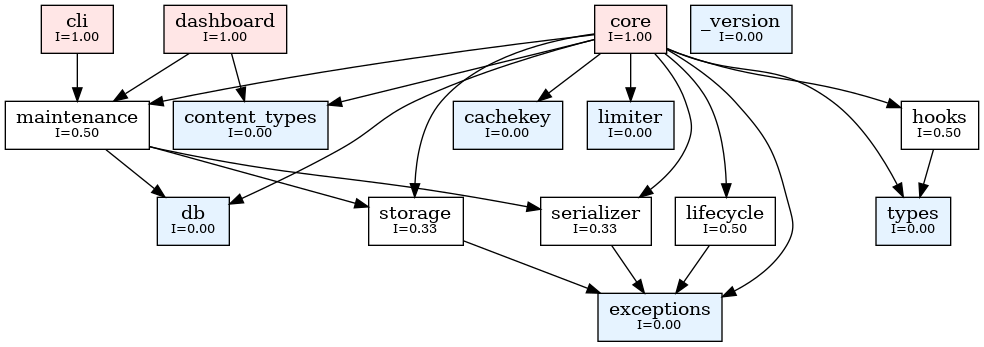
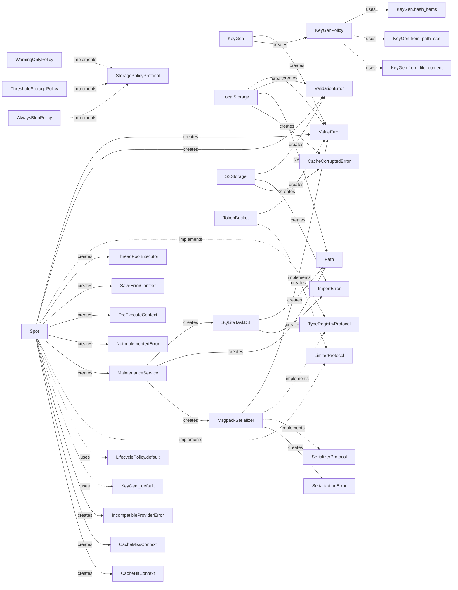

# 📊 Beautyspot Quality Report
**最終更新:** 2026-02-24 00:38:34

## 1. アーキテクチャ可視化
### 1.1 依存関係図 (Pydeps)


### 1.2 安定度分析 (Instability Analysis)
青: 安定(Core系) / 赤: 不安定(高依存系)。矢印は依存の方向を示します。


<details>
<summary>🔍 安定度メトリクスの詳細（Ca/Ce/I）を表示</summary>

```text
Module          | Ca  | Ce  | I (Instability)
---------------------------------------------
limiter         | 1   | 0   | 0.00
cli             | 0   | 1   | 1.00
dashboard       | 0   | 2   | 1.00
db              | 2   | 0   | 0.00
exceptions      | 4   | 0   | 0.00
lifecycle       | 1   | 1   | 0.50
serializer      | 2   | 1   | 0.33
_version        | 0   | 0   | 0.00
types           | 2   | 0   | 0.00
content_types   | 2   | 0   | 0.00
cachekey        | 1   | 0   | 0.00
hooks           | 1   | 1   | 0.50
storage         | 2   | 1   | 0.33
maintenance     | 3   | 3   | 0.50
core            | 0   | 11  | 1.00

Graph generated at: docs/statics/img/generated/architecture_metrics.png
```
</details>

## 2. コード品質メトリクス
### 2.1 循環的複雑度 (Cyclomatic Complexity)
#### ⚠️ 警告 (Rank C 以上)
複雑すぎてリファクタリングが推奨される箇所です。

```text
src/beautyspot/cli.py
    F 304:0 show_cmd - C
    F 556:0 gc_cmd - C
    F 671:0 prune_cmd - C
src/beautyspot/maintenance.py
    M 186:4 MaintenanceService.clean_garbage - C

4 blocks (classes, functions, methods) analyzed.
Average complexity: C (14.0)
```

<details>
<summary>📄 すべての CC メトリクス一覧を表示</summary>

```text
src/beautyspot/limiter.py
    M 44:4 TokenBucket._consume_reservation - A
    C 16:0 TokenBucket - A
    C 10:0 LimiterProtocol - A
    M 28:4 TokenBucket.__init__ - A
    M 74:4 TokenBucket.consume - A
    M 92:4 TokenBucket.consume_async - A
    M 11:4 LimiterProtocol.consume - A
    M 13:4 LimiterProtocol.consume_async - A
src/beautyspot/cli.py
    F 304:0 show_cmd - C
    F 556:0 gc_cmd - C
    F 671:0 prune_cmd - C
    F 395:0 stats_cmd - B
    F 150:0 _list_tasks - B
    F 216:0 ui_cmd - B
    F 480:0 clean_cmd - B
    F 90:0 _list_databases - A
    F 453:0 clear_cmd - A
    F 50:0 _find_available_port - A
    F 60:0 _format_size - A
    F 75:0 _get_task_count - A
    F 33:0 get_service - A
    F 286:0 list_cmd - A
    F 769:0 version_cmd - A
    F 45:0 _is_port_in_use - A
    F 68:0 _format_timestamp - A
    F 788:0 main - A
src/beautyspot/dashboard.py
    F 54:0 load_data - A
    F 14:0 get_args - A
    F 35:0 render_mermaid - A
src/beautyspot/db.py
    M 131:4 SQLiteTaskDB.init_schema - B
    M 165:4 SQLiteTaskDB.get - B
    M 279:4 SQLiteTaskDB.get_outdated_tasks - A
    M 310:4 SQLiteTaskDB.get_blob_refs - A
    F 20:0 _ensure_utc_isoformat - A
    C 104:0 SQLiteTaskDB - A
    M 230:4 SQLiteTaskDB.get_history - A
    M 321:4 SQLiteTaskDB.get_keys_start_with - A
    C 35:0 TaskDBBase - A
    M 114:4 SQLiteTaskDB._connect - A
    M 254:4 SQLiteTaskDB.delete_all - A
    M 264:4 SQLiteTaskDB.prune - A
    M 299:4 SQLiteTaskDB.delete_expired - A
    C 29:0 TaskRecord - A
    M 41:4 TaskDBBase.init_schema - A
    M 45:4 TaskDBBase.get - A
    M 49:4 TaskDBBase.save - A
    M 64:4 TaskDBBase.get_history - A
    M 68:4 TaskDBBase.delete - A
    M 72:4 TaskDBBase.delete_expired - A
    M 76:4 TaskDBBase.prune - A
    M 83:4 TaskDBBase.get_outdated_tasks - A
    M 91:4 TaskDBBase.get_blob_refs - A
    M 95:4 TaskDBBase.delete_all - A
    M 99:4 TaskDBBase.get_keys_start_with - A
    M 109:4 SQLiteTaskDB.__init__ - A
    M 198:4 SQLiteTaskDB.save - A
    M 249:4 SQLiteTaskDB.delete - A
src/beautyspot/exceptions.py
    C 4:0 BeautySpotError - A
    C 12:0 CacheCorruptedError - A
    C 19:0 SerializationError - A
    C 25:0 ConfigurationError - A
    C 32:0 ValidationError - A
    C 39:0 IncompatibleProviderError - A
src/beautyspot/lifecycle.py
    F 14:0 parse_retention - B
    C 65:0 LifecyclePolicy - A
    M 73:4 LifecyclePolicy.resolve - A
    C 49:0 Retention - A
    C 56:0 Rule - A
    M 70:4 LifecyclePolicy.__init__ - A
    M 85:4 LifecyclePolicy.default - A
src/beautyspot/serializer.py
    M 92:4 MsgpackSerializer._default_packer - B
    C 46:0 MsgpackSerializer - A
    M 169:4 MsgpackSerializer.dumps - A
    M 60:4 MsgpackSerializer.register - A
    M 146:4 MsgpackSerializer._ext_hook - A
    M 191:4 MsgpackSerializer.loads - A
    C 20:0 SerializerProtocol - A
    C 32:0 TypeRegistryProtocol - A
    M 26:4 SerializerProtocol.dumps - A
    M 28:4 SerializerProtocol.loads - A
    M 37:4 TypeRegistryProtocol.register - A
    M 54:4 MsgpackSerializer.__init__ - A
src/beautyspot/types.py
    C 9:0 SaveErrorContext - A
    C 43:0 HookContextBase - A
    C 54:0 PreExecuteContext - A
    C 61:0 CacheHitContext - A
    C 69:0 CacheMissContext - A
src/beautyspot/content_types.py
    C 6:0 ContentType - A
src/beautyspot/cachekey.py
    F 126:0 _canonicalize_type - B
    F 64:0 canonicalize - B
    F 41:0 _canonicalize_instance - A
    M 272:4 KeyGen.from_file_content - A
    M 290:4 KeyGen._default - A
    F 53:0 _is_ndarray_like - A
    C 251:0 KeyGen - A
    M 322:4 KeyGen.hash_items - A
    F 20:0 _safe_sort_key - A
    F 91:0 _canonicalize_dict - A
    F 101:0 _canonicalize_sequence - A
    F 108:0 _canonicalize_set - A
    C 194:0 KeyGenPolicy - A
    M 263:4 KeyGen.from_path_stat - A
    M 339:4 KeyGen.ignore - A
    M 354:4 KeyGen.file_content - A
    M 362:4 KeyGen.path_stat - A
    F 36:0 _canonicalize_ndarray - A
    F 115:0 _canonicalize_enum - A
    F 169:4 _canonicalize_np_ndarray - A
    C 181:0 Strategy - A
    M 200:4 KeyGenPolicy.__init__ - A
    M 208:4 KeyGenPolicy.bind - A
    M 347:4 KeyGen.map - A
src/beautyspot/hooks.py
    C 44:0 ThreadSafeHookBase - A
    M 68:4 ThreadSafeHookBase.__init_subclass__ - A
    C 12:0 HookBase - A
    F 33:0 _wrap_with_lock - A
    M 23:4 HookBase.pre_execute - A
    M 26:4 HookBase.on_cache_hit - A
    M 29:4 HookBase.on_cache_miss - A
    M 74:4 ThreadSafeHookBase.__init__ - A
src/beautyspot/storage.py
    M 214:4 LocalStorage.prune_empty_dirs - B
    M 270:4 S3Storage._parse_s3_uri - A
    C 120:0 LocalStorage - A
    M 126:4 LocalStorage._validate_key - A
    M 160:4 LocalStorage.load - A
    M 200:4 LocalStorage.list_keys - A
    C 253:0 S3Storage - A
    M 254:4 S3Storage.__init__ - A
    C 50:0 WarningOnlyPolicy - A
    M 133:4 LocalStorage.save - A
    M 181:4 LocalStorage.delete - A
    M 303:4 S3Storage.list_keys - A
    F 311:0 create_storage - A
    C 27:0 StoragePolicyProtocol - A
    C 37:0 ThresholdStoragePolicy - A
    M 59:4 WarningOnlyPolicy.should_save_as_blob - A
    C 69:0 AlwaysBlobPolicy - A
    C 82:0 BlobStorageBase - A
    M 288:4 S3Storage.load - A
    M 296:4 S3Storage.delete - A
    M 33:4 StoragePolicyProtocol.should_save_as_blob - A
    M 45:4 ThresholdStoragePolicy.should_save_as_blob - A
    M 75:4 AlwaysBlobPolicy.should_save_as_blob - A
    M 88:4 BlobStorageBase.save - A
    M 96:4 BlobStorageBase.load - A
    M 103:4 BlobStorageBase.delete - A
    M 111:4 BlobStorageBase.list_keys - A
    M 121:4 LocalStorage.__init__ - A
    M 282:4 S3Storage.save - A
src/beautyspot/maintenance.py
    M 186:4 MaintenanceService.clean_garbage - C
    M 84:4 MaintenanceService.get_task_detail - B
    M 164:4 MaintenanceService.scan_garbage - B
    M 32:4 MaintenanceService.from_path - A
    M 123:4 MaintenanceService.delete_task - A
    M 273:4 MaintenanceService.scan_orphan_projects - A
    C 18:0 MaintenanceService - A
    M 245:4 MaintenanceService.resolve_key_prefix - A
    M 293:4 MaintenanceService.delete_project_storage - A
    M 23:4 MaintenanceService.__init__ - A
    M 80:4 MaintenanceService.get_history - A
    M 118:4 MaintenanceService.delete_expired_tasks - A
    M 145:4 MaintenanceService.get_prunable_tasks - A
    M 151:4 MaintenanceService.prune - A
    M 158:4 MaintenanceService.clear - A
src/beautyspot/__init__.py
    F 43:0 Spot - B
src/beautyspot/core.py
    M 773:4 Spot._check_cache_sync - B
    M 364:4 Spot.shutdown - B
    M 1052:4 Spot.cached_run - B
    M 382:4 Spot._drain_futures - A
    M 399:4 Spot._trigger_auto_eviction - A
    M 424:4 Spot._resolve_key_fn - A
    M 143:4 _BackgroundLoop.stop - A
    C 195:0 Spot - A
    M 241:4 Spot.__init__ - A
    M 510:4 Spot._dispatch_hooks - A
    M 528:4 Spot._resolve_settings - A
    M 568:4 Spot._execute_sync - A
    M 667:4 Spot._execute_async - A
    M 816:4 Spot._submit_background_save - A
    M 835:4 Spot._save_result_safe - A
    M 869:4 Spot._save_result_sync - A
    F 68:0 _shutdown_all_loops - A
    C 83:0 _BackgroundLoop - A
    M 451:4 Spot.register - A
    M 492:4 Spot._calculate_expires_at - A
    M 547:4 Spot._make_cache_key - A
    M 953:4 Spot.mark - A
    M 112:4 _BackgroundLoop.stop_gracefully_no_wait - A
    M 336:4 Spot.maintenance - A
    M 350:4 Spot._setup_workspace - A
    M 476:4 Spot.register_type - A
    M 91:4 _BackgroundLoop.__init__ - A
    M 100:4 _BackgroundLoop._run - A
    M 108:4 _BackgroundLoop.submit - A
    M 313:4 Spot.__enter__ - A
    M 316:4 Spot.__exit__ - A
    M 324:4 Spot._track_future - A
    M 359:4 Spot._shutdown_resources - A
    M 830:4 Spot._save_result_async - A
    M 915:4 Spot.consume - A
    M 936:4 Spot.mark - A
    M 939:4 Spot.mark - A
    M 1020:4 Spot.cached_run - A
    M 1037:4 Spot.cached_run - A

204 blocks (classes, functions, methods) analyzed.
Average complexity: A (2.843137254901961)
```
</details>

### 2.2 保守性指数 (Maintainability Index)
#### ⚠️ 警告 (Rank B 以下)
コードの読みやすさ・保守しやすさに改善の余地があるモジュールです。

```text
なし（すべて Rank A です ✨）
```

<details>
<summary>📄 すべての MI メトリクス一覧を表示</summary>

```text
src/beautyspot/limiter.py - A
src/beautyspot/cli.py - A
src/beautyspot/dashboard.py - A
src/beautyspot/db.py - A
src/beautyspot/exceptions.py - A
src/beautyspot/lifecycle.py - A
src/beautyspot/serializer.py - A
src/beautyspot/_version.py - A
src/beautyspot/types.py - A
src/beautyspot/content_types.py - A
src/beautyspot/cachekey.py - A
src/beautyspot/hooks.py - A
src/beautyspot/storage.py - A
src/beautyspot/maintenance.py - A
src/beautyspot/__init__.py - A
src/beautyspot/core.py - A
```
</details>

## 4. デザイン・インテント分析 (Design Intent Map)
クラス図には現れない、生成関係、静的利用、および Protocol への暗黙的な準拠を可視化します。


