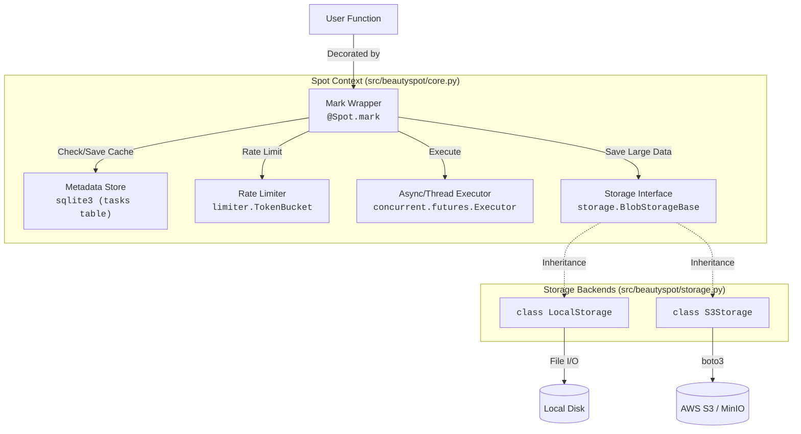
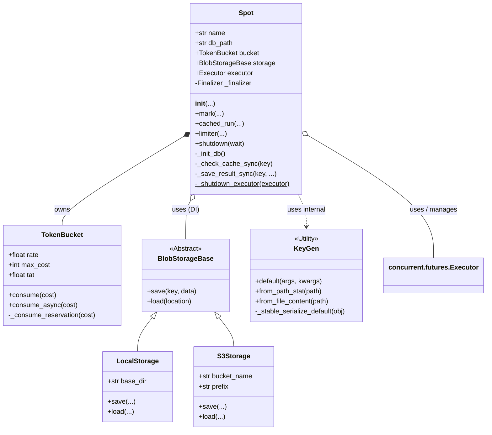
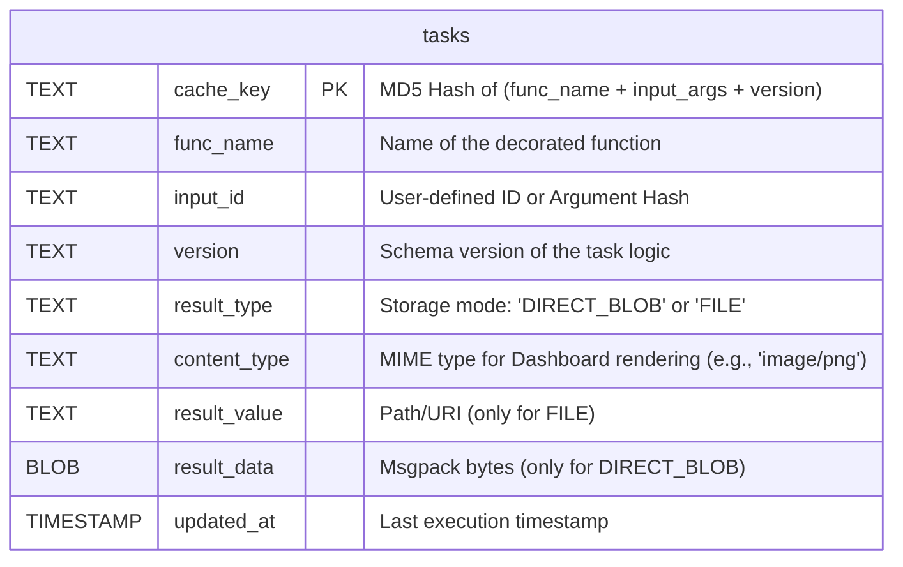

# Architecture & Design

## 🏗️ Architecture & Design Overview

`beautyspot` は、関数デコレータを通じて「実行制御（Caching, Rate Limiting, Persistence）」を既存のロジックに注入する、**非侵入型（Non-intrusive）** のミドルウェアライブラリです。

### 1. Core Philosophy: "The Kuroko (黒子) Pattern"

ユーザーのビジネスロジック（関数）を汚染せず、インフラストラクチャの複雑性を隠蔽することを設計の主眼としています。

* **No Inheritance:** ユーザーは特定のクラスを継承する必要がない。
* **No Global State:** `Spot` インスタンスごとに独立した状態（DB, TokenBucket）を持つ。
* **Fail-Safe:** ライブラリ内部の整合性エラーが、ユーザーのアプリケーションをクラッシュさせてはならない。

---

### 2. System Components & Code Mapping

各コンポーネントが、コードベース上のどのクラス・モジュールに対応するかを明記したシステム図です。

#### 2.1. Metadata Store (SQLite)

タスクの実行履歴と「データの在り処（ポインタ）」を管理します。
WAL (Write-Ahead Logging) モードを採用し、並行読み書き性能を確保しています。
v2.0 以降も互換性維持のため、内部テーブル名は `tasks` のまま使用されています。

#### 2.2. Blob Storage (Storage Strategy)

画像、音声、長文テキストなどの巨大なデータをDBから分離する **"Claim Check Pattern"** を採用しています。
抽象基底クラス `BlobStorageBase` により、バックエンドの差し替えが可能です。

> **Note on Multi-modal Support:**
> 現在は `LocalStorage` と `S3Storage` を提供しています。
> 設計上はバイナリデータを透過的に扱うため、将来的な **Audio (WAV/MP3)** や **Video (MP4)** などのマルチメディアデータ、およびそれらに特化したストレージバックエンドの拡張を見据えています。

#### 2.3. Rate Limiter (GCRA)

**GCRA (Generic Cell Rate Algorithm)** を採用しています。
通常のトークンバケットと異なり、**"Theoretical Arrival Time (TAT)"** を管理することで、長時間アイドル後のバースト（集中アクセス）を物理的に防ぎます。

---

### 3. Class Diagram

主要クラスの依存関係と責務の構造です。`Spot` クラスが `Facade` として機能し、各コンポーネントを統括しています。

---

### 4. Database Schema (ER Diagram)

SQLite内部の `tasks` テーブルのスキーマ定義です。
マイグレーションは `Spot` 初期化時に動的チェック（Auto-Migration）によって行われます。

* **`result_type`**:
* `DIRECT_BLOB`: 小さいデータ。`result_data` カラムに Msgpack バイナリとして直接格納。
* `FILE`: 大きいデータ (`save_blob=True`)。`result_value` にファイルパスまたは S3 URI を格納。

* **`content_type`**:
* ダッシュボードでの可視化に使用（例: `text/vnd.mermaid`, `image/png`）。

---

### 5. Execution Flow (`@mark` Decorator)

1. **Hash Generation:** 引数 (`args`, `kwargs`) と `version` から一意な `cache_key` を生成。
2. **Cache Check:** SQLiteを参照。
* Hit -> `result_type` に応じてデータを復元（`msgpack.unpack`）して即座に return。
* Miss -> 次へ進む。

3. **Execution:** ユーザー関数を実行。
* **Exception:** 例外が発生した場合、**キャッシュは行わず** そのまま例外を上位へ伝播させる（バグの永続化防止）。

4. **Persistence:**
* Small Data -> `DIRECT_BLOB` モードでSQLiteにバイナリ保存。
* Large Data (`save_blob=True`) -> `FILE` モードでStorageに保存し、パスのみをSQLiteに記録。

---

### 6. Key Technical Decisions (ADR Summary)

この設計に至った重要な意思決定の履歴です。

* **ADR-0001: Stable Hashing**
* `json` ベースの正規化を採用し、異なる環境間でのキーの一致率を向上させた。

* **ADR-0002: GCRA Rate Limiter**
* 単純なトークンバケットの「バースト問題」を解決するために、TATベースのアルゴリズムを採用した。

* **ADR-0007: Msgpack Serialization (v2.0)**
* `pickle` のセキュリティリスク（RCE）を排除するため、デフォルトのシリアライザを `msgpack` に変更した。

* **ADR-0011: Rename Project to Spot (v2.0)**
* ライブラリ名および "Beauty Spot"（ほくろ）というコンセプトとの整合性を高めるため、管理クラスを `Spot`、デコレータを `mark` に変更した。

