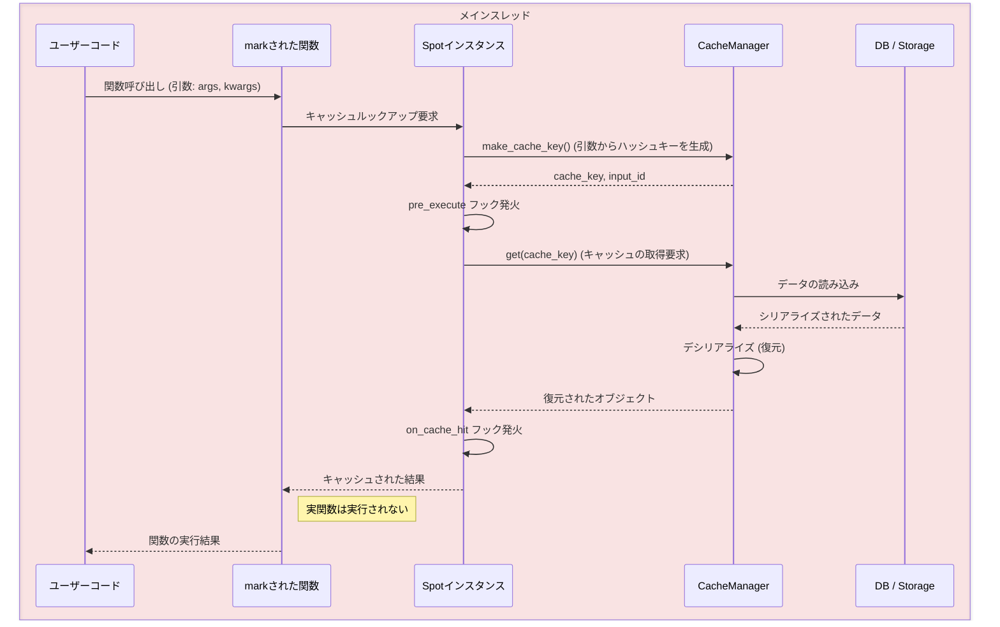
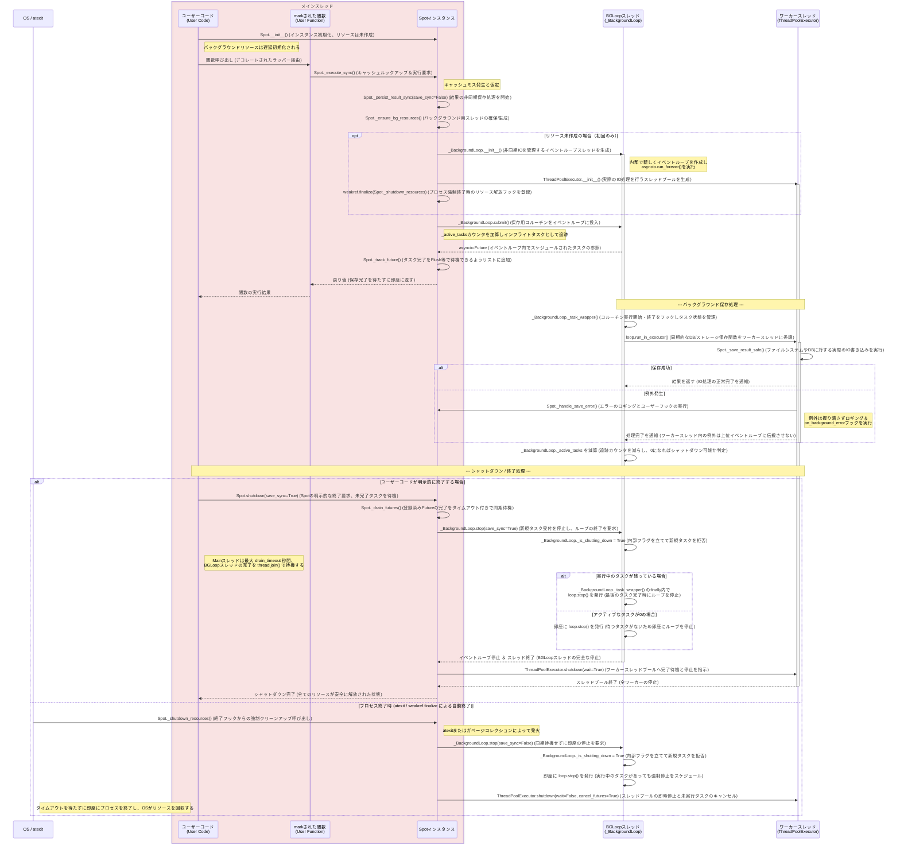

# Spot (Core)

`Spot` クラスは `beautyspot` のメインエントリポイントです。関数のマーキング（登録）、キャッシュのルックアップ、および実行結果の永続化をオーケストレートします。

::: beautyspot.core

## 主なコンセプト

### 1. タスクの登録と実行

`@spot.mark` デコレータを使用、または `spot.cached_run()` で関数を登録することで、その関数は自動的にキャッシュ対応となります。入力引数に基づいて一意のキャッシュキーが生成され、同じ引数での呼び出しはストレージから結果を復元します。

### 2. 非ブロッキング保存 (Non-blocking Persistence)

v2.0 では、`Spot` 初期化時に `default_wait=False` を設定するか、`@mark(wait=False)` を指定することで、保存処理をバックグラウンドスレッドで実行できます。これにより、計算終了直後に制御がユーザーに戻り、I/O 待ちによる遅延が解消されます。

### 3. 同期ポイントとしての Flush

`with spot:` ブロック（コンテキストマネージャ）を使用すると、そのブロックを抜ける際に、実行中のすべてのバックグラウンド保存タスクの完了を待機（Flush）します。
これは、プログラムの終了前やバッチ処理の区切りでデータの整合性を保証するために重要です。

### 4. ライフサイクルフック (Lifecycle Hooks)

v2.0から、関数の実行パイプラインに介入できるクラスベースのフックシステム (`HookBase`) が導入されました。`@spot.mark(hooks=[...])` を指定することで、関数の実行前 (`pre_execute`)、キャッシュヒット時 (`on_cache_hit`)、キャッシュミス時 (`on_cache_miss`) にカスタムロジックを差し込めます。これにより、レイテンシ計測やAPIコスト計算などを容易に実装できます。

## 使用例

### 基本的なデコレータの使用

```python
@spot.mark(version="1.0", save_blob=True)
def heavy_task(data):
    # 重い処理
    return result


```

### 局所的なキャッシュ実行 (cached_run)

デコレートせずに関数を一時的にキャッシュ化したい場合に使用します。`with` ブロックを使うと変数スコープを明確にできますが、返されたラッパーはブロック外でも有効です。

```python
with spot.cached_run(my_func, version="v1") as task:
    result = task(arg)

# task はブロック外でも @spot.mark(version="v1") 相当のラッパーとして有効

```

### バックグラウンド保存の制御

```python
# 保存を待たずに即座に値を返す
@spot.mark(wait=False)
def async_save_task(x):
    return x * 10

with spot:
    async_save_task(1)
    async_save_task(2)
# ここを抜ける時に 1 と 2 の保存完了が保証される


```

### メトリクス収集フックの使用

```python
from beautyspot.hooks import HookBase

class MetricsHook(HookBase):
    def on_cache_miss(self, context):
        print(f"[{context.func_name}] 実関数が実行されました。")
    
    def on_cache_hit(self, context):
        print(f"[{context.func_name}] キャッシュが利用されました！")

@spot.mark(hooks=[MetricsHook()])
def fetch_data(query: str):
    return "Result"

```

## 関連コンポーネント

* **[CacheManager](cache.md)**: キャッシュのキー生成、読み書き、Thundering Herd対策などの内部ロジックを担当するコンポーネントです。

## 注意事項

* **シャットダウン**: `spot.shutdown()` を呼ぶと Executor が停止し、それ以降バックグラウンド保存は利用できなくなります。
* **スレッドセーフ**: 内部で `ThreadPoolExecutor` を使用しているため、注入される DB や Storage はスレッドセーフである必要があります。

## 動作フローチャート

### キャッシュヒットした場合（同期パス）

キャッシュにデータが存在する場合、バックグラウンドスレッドは関与せず、メインスレッド内で直接データの復元が行われます。



### キャッシュヒットしなかった場合（バックグラウンド保存）


